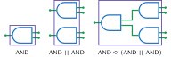
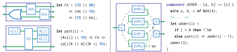
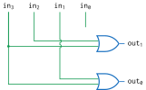
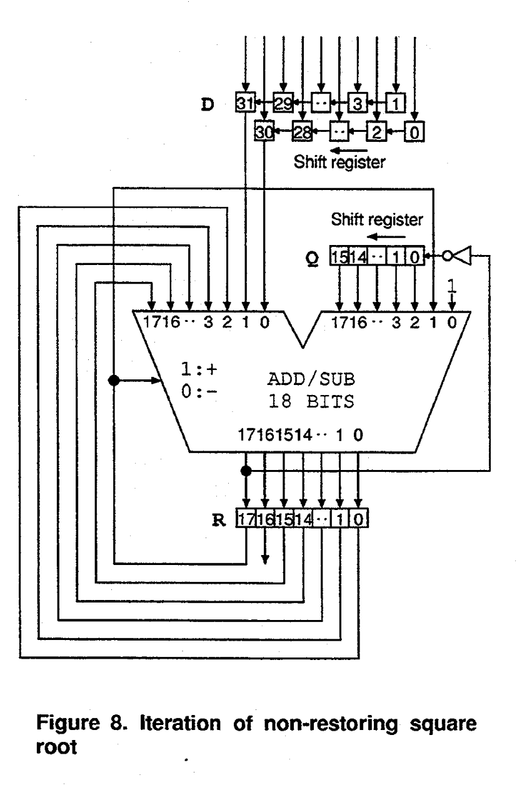

数字电路系统是现代计算机与电子工业工程的基础。本教程将介绍如何使用一种新兴的硬件描述语言 NetX 进行数字电路设计。在设计和实现数字电路时，我们脑海里总是会先有一个大概的电路图，接着使用硬件描述语言来描绘它——而 NetX 代码的组织形式与电路图的结构非常相似，用 NetX 编码几乎就是所见即所得地描述电路图的过程。

本教程只作简单介绍。更多细节可以参考 NetX 的语言手册。

---

我们首先介绍 NetX 中最基础的两个运算符，`||` 与 `<>`，分别称作并行组合子与串行组合子。简单来说，`||` 就像把两个电路元件并排放置，而 `<>` 就像用导线连接元件的输出和输入。下面我们小试牛刀，用这两个运算符把二输入与门组合成一个四输入与门：

<center>

</center>

我们从与门 `AND` 出发，首先用 `||` 并列连接两个与门，这就得到了一个四输入、两输出的电路元件。这个元件的内部有两个并列的与门，分别处理整个元件的前两个、后两个输入并分别输出。接下来，我们用 `<>` 将这个元件的输出串接到第三个与门上，也就得到了一个四输入、一输出的元件——也就是一个四输入与门。

使用 NetX 内置的、包括 `AND` 的各种基础逻辑门，我们还可以组合出稍复杂一些的元件。比如，可以通过下面的代码实现一个半加器（Half Adder, HA）。半加器是数字电路中最基本的加法器，用于实现两个一位二进制数的加法。它有两个输入（通常记作 `a` 和 `b`），产生两个输出：

- sum（和）：表示 `a` 和 `b` 相加后的结果，不包括进位。
- carry（进位）：表示 `a` 和 `b` 相加时是否产生进位。

具体来说，半加器的逻辑关系如下表所示：

| a    | b    | sum  | carry |
| :--- | :--- | :--- | :---- |
| 0    | 0    | 0    | 0     |
| 0    | 1    | 1    | 0     |
| 1    | 0    | 1    | 0     |
| 1    | 1    | 0    | 1     |

当 `a` 和 `b` 都为 0 时，和与进位都为 0；当只有一个为 1 时，和为 1，进位为 0；当两个都为 1 时，和为 0，进位为 1（因为 1+1=2，二进制下“2”表示为 10）。仔细观察，半加器的电路结构其实非常简单，只需要一个与门和一个异或门（当两个输入不同时才输出一）即可实现：

```netx
// 定义一个半加器元件，它的输入是 a, b；输出是 sum, carry
component HA : [a, b] -> [sum, carry] {
	// 定义四条电线，它们可以传输一位二进制数	
	// 电线可以理解成一种特殊的元件，有一个输入和一个输出，可以正常地和其他元件拼在一起
	wire a, b, sum, carry of bit(1);
	
	  sum <> XOR <> (a || b); 
	carry <> AND <> (a || b);
}
```

---



半加器实现了宽度为 1 的二进制加法，接着我们来实现位宽更多的加法。对于给定的输入 `a` 和 `b`，最简单的思路是从低位向高位依次计算每一个二进制位的和。这里每一步都是宽度为 1 的加法。但是要注意，计算每一位的和时，除了要考虑当前的输入 `a[i]` 和 `b[i]`，还需要考虑前一位加法进位 `cin`。因此，我们需要一个可以处理三个输入的元件——全加器。

首先让我们了解一个特殊的内置元件 `TO`，它可以理解为匿名的"电线"，会将输入信号直接传递到输出端。有了这个概念，我们就可以对照图片左上角的电路图，用一种简洁的方式来描述全加器：

```netx
let FA = (TO || OR) <> (HA || TO) <> (TO || HA);
```

这行代码描述了全加器的结构：两个半加器加一个或门。不过这种写法比较抽象，你可能暂时有些不适应。不过我们也可以给每个元件的输入输出端口起个名字，写成下面的样子：

```netx
component FA : [a, b, cin] -> [sum, cout] {
    wire a, b, cin, sum, cout of bit(1);
    wire tmp_sum, c1, c2 of bit(1);
    (tmp_sum || c1) <> HA <> (b || cin);
        (sum || c2) <> HA <> (a || tmp_sum);
    cout <> OR <> (c1 || c2);
}
```

好了，接下来把全加器串联起来，让第 `i` 个全加器的进位输出 `cout` 连接到第 `i+1` 个全加器的进位输入 `cin`，就可以实现任意位宽的二进制加法了。下面是一个 4 位加法器的代码示例：

```netx
component ADDER : [a, b] -> [c] {
	wire a, b, c of bit(4);
	let FA = (TO || OR) <> (HA || TO) <> (TO || HA);
	let pattern(i) = 
		(#c[i] || TO) <> FA <> (a[i]# || b[i]# || TO);
	let adder(i) =
		if i < 0 then 1'b0
		else pattern(i) <> adder(i - 1);
	adder(3);
}
```

在这个代码中，我们使用了一个递归的方式来定义加法器。`pattern(i)` 定义了第 `i` 个全加器，把它的输入输出绑定到 `a[i]`、`b[i]` 和 `c[i]` 上，但是把进位输入和输出用 `TO` 留空。

这里出现了一个新的运算符 `#`，它表示"忽略"某个端口。具体来说：
- `#c[i]` 表示只使用 `c[i]` 的输入端口，忽略它的输出端口
- `a[i]#` 表示只使用 `a[i]` 的输出端口，忽略它的输入端口

回忆：之前我们说“电线是一种特殊的元件，它有一个输入和一个输出”。那么如果不用 `#` 运算符忽略电线的输入或输出，那么 `pattern(i)` 的输入输出端口数量和 `FA` 还是相同的——它只是在 `FA` 的基础上多连了几条电线而已。但是通过 `#` 运算符，我们可以忽略掉 `FA` 的一些输入或输出端口，从而使得 `pattern(i)` 变成一个一进一出的元件。而这样的元件可以方便地用递归宏 `adder(i)` 前后串接起来。

当然，如果你不熟悉递归的写法，也可以引入一个中间变量，写成下面更直观的样子：

```netx
component ADDER : [a, b] -> [c] {
	wire a, b, c of bit(4);
	wire carry of bit(4);
	let cin(i) = if i == 0 then 1'b0 else carry[i - 1];
	for (i in [0..4]) {
		(c[i] || carry[i]) <> FA <> (
			a[i] || b[i] || cin(i)
       );	
	}
	adder(3);
}
```

---

下面我们考虑另外一种常见的组合电路：编码器，我们常常用它将热独码转为二进制码。换言之：编码器有 $$2^n$$ 个输入，其中只有一个输入为 `1`，其余输入均为 `0`。假设第 $$i$$ 个输入为 `1`，则编码器的输出为 $$i$$ 的二进制表示（宽度为 $$n$$）。下面展示了一个 4-2 编码器的电路图：



观察电路图发现，编码器其实是通过一系列或门计算最终的输出的：既然第 $$j$$ 个输出为 `1` 当且仅当 $$i$$ 的二进制表示的第 $$j$$ 位为 `1`，那么我们只需要用一个或门把所有二进制表示第 $$j$$ 位为 `1` 的输入端口连接起来就可以了。下面是一个 4-2 编码器的 NetX 代码实现：

```netx
component ENCODER(n) : [input] -> [output] {
	let power = 2 ** n;
	wire input of bit(power);
	wire output of bit(n);
	for (j in [0..n]) {
		output[j] <> OR <> [
			input[i] | i in [0..power], 
			           when (i >> j) & 1 == 1  // 选择二进制第j位为1的输入
		];
	}
}
```

这里出现了一种新的语法： 列表推导式（List Comprehension）也即 `[... | ...]`。由于数字电路是高度并行的，实践中我们经常会遇到形如 `(x1 || x2 || ... || xn)` 这样非常长的并行组合。为了简化起见，NetX 引入了列表 `[x1, x2, ..., xn]` 表达相同的意思。虽然列表本身看起来和原来没什么差别，但是我们可以通过列表推导来表达复杂的逻辑。比如上面的代码中，列表推导

```netx
[input[i] | i in [0..power], when (i >> j) & 1 == 1]
```

表达的意思就是生成一个列表，列表中有许多元素 `input[i]`，其中 `i` 是 $$0$$ 到 $$2^n-1$$ 之间的数字，但是只有当 `i` 的二进制表示的第 $$j$$ 位为 `1` 时（即 `i >> j & 1 == 1`），才会把 `input[i]` 加入到列表中。比如当 `n == 2`，`j == 1` 时，我们就会得到列表 `[input[2], input[3]]`，它等价于 `(input[2] || input[3])`。通过类似的列表推导，我们可以把电路图中重复的、复杂的图形模式抽象出来，从而写出更简洁的代码。

---

到目前为止，我们已经大概了解了怎么使用 NetX 设计组合电路。接下来我们看看如何设计时序电路，也就是含有寄存器等存储元件，可以记录状态的电路。

NetX 首先内置了一个简单的寄存器 `REGISTER`，使用时大概像是这样：

```netx
output <> REGISTER(pos_edge = true) <> [input, clk]
```

它含有一个参数 `pos_edge`，规定该元件是在时钟的上升沿还是下降沿触发（这里 `pos_edge=true`，意思是寄存器在时钟上升沿触发，即当 `clk` 从 `0` 变为 `1` 时，寄存器的值更新 ）。`input` 是寄存器的输入端口，`clk` 是时钟信号。寄存器会在时钟的上升沿（或下降沿）把 `input` 的值存储到输出端口 `output` 上。

在实际应用中，我们经常需要包含复位信号（reset）的寄存器。复位信号可以在系统启动或出错时将寄存器强制设置为已知的初始值：

```netx
import std.selector.MUX; // 从标准库里引入多路选择器 MUX

component REG(pos_edge, high_rst, rst_value) : [clk, rst, input] -> [output] {
	wire clk of clock();
	auto input, output; // 让编译器根据使用场景自动推断位宽
	
	output <> REGISTER(pos_edge) <> (
		MUX(1) <> (
            if high_rst 
            then [rst, input, rst_value]
            else [rst, rst_value, input]
        ) || clk
	);
}
```

这里 `MUX` 是数字电路中的条件选择模块，工作方式如下：

- `MUX(1) <> [sel, data0, data1]` 表示当选择信号 `sel` 为 `0` 时输出 `data0`，为 `1` 时输出 `data1`；
- 括号中的 `1` 表示选择信号的位宽为 1 位。

在我们的复位寄存器中：
- 当 `high_rst` 为真时，`MUX` 的参数顺序是 `[rst, input, rst_value]`，意思是当 `rst` 为高电平 `1` 时选择 `rst_value`；
- 当 `high_rst` 为假时，参数顺序是 `[rst, rst_value, input]`，意思是当 `rst` 为低电平 `0` 时选择 `rst_value`。

在使用这个含有复位信号的寄存器时，我们就可以写成：

```netx
my_output <> REG(true, true, 0) <> [my_clk, my_rst, my_input]
```

或者为了让代码更清晰，写成：

```netx
{output : my_output} <> REG (
	pos_edge = true, 
	high_rst = true, 
	rst_value = 0
) <> {
	clk : my_clk,
	rst : my_rst,
	input : my_input
};
```

显式地指定输入输出端口的名字。这种写法在复杂电路中特别有用，因为可以清楚地看到每个信号的用途。

---

现在我们就可以利用寄存器设计时序电路了。我们先来看一个经典的例子：用时序电路实现一个简单的红绿灯状态机。它有红绿黄三种状态，红灯亮 30 秒时将会变为绿灯，绿灯亮 25 秒后变为黄灯，黄灯亮 5 秒后变为红灯。我们可以用一个状态转移图来描述这个过程：


对照状态转移图，我们可以设计出下面的电路：

```netx
import std.utils.REG;

// 定义枚举类型，包含红绿黄三种状态
// 编译器会自动推断 State 的位宽为 2
// 并且分配 RED=2'b00, GREEN=2'b01, YELLOW=2'b10
enum State {
  RED, GREEN, YELLOW
};

// 计数器组件，用来记录距离上次变灯经过的时间
component COUNTER : [clk, rst] -> [count] {
	wire count of bit(32);
	wire clk of clock();
	wire rst of bit(1);
	
	// 当 rst 信号到来时重置为 0，否则每个时钟周期加 1
	count <> REG (
		pos_edge=true, high_rst=true, rst_value=0
    ) <> [clk, rst, ADD <> [count, 1]];
}

// 红绿灯状态机组件
component TRAFFIC_LIGHT : [clk] -> [color] {
	wire color of State;
	wire clk of clock();
	
	// 判断是否需要变灯
	wire change of bit(1);
	auto counter <> COUNTER <> [clk, change];
	change <> EQ <> [
		counter,
		MUX(2) <> [color, 30, 25, 5, 0] // 根据当前颜色决定计数器的阈值
	];
	
	let clocked_reg = REGISTER(pos_edge = true) <> [TO, clk#];
	color <> clocked_reg <> MUX(1) <> [change, 
		color,                                   // 如果无需变灯，保持当前颜色
		MUX(2) <> [color, GREEN, YELLOW, RED, 0] // 根据当前颜色决定下一个颜色
    ];
}
```

---

特别地，NetX 所见即所得的设计允许你直接从电路图出发，就算不理解背后的行为、原理也可以把电路实现出来。这里我们借用 [ICCD'96](https://doi.org/10.1109/ICCD.1996.563604) 一篇论文提出的开平方电路作为例子。文章中给出了这样一个设计，它每个周期处理两位输入信号，用总计 16 个时钟周期计算 32 位数的平方根。电路图如下所示：



即便你没有读过这篇文章，完全不理解这个开方算法的原理，也可以用 NetX 重新绘制这个电路图，之后就可以通过 NetX 的编译器、仿真器等设施真正地实现这个电路。下面是这个开平方电路的 NetX 代码实现：

```netx
import std.memory.SHIFT_REG; // 从标准库引入移位寄存器 SHIFT_REG
import std.utils.REG;

component SQRT32(pos_edge, high_rst) : [clk, rst, D] -> [Q] {
  wire clk of clock();
  wire rst of bit(1);
  wire D of bit(32);
  wire Q of bit(16);

  wire R, R_next, lhs, rhs of bit(18);
  let shift(init_value) = SHIFT_REG(16, pos_edge, high_rst, init_value) <> [clk#, rst#, TO];
  
  // 这里 CONCAT 是一种内置组件，它将所有输入信号前后连接成一个更宽的信号
  auto D_odd <> shift(CONCAT <> [D[i * 2 + 1] | i in [16..0]]) <> 1'b0;
  auto D_eve <> shift(CONCAT <> [D[i * 2]     | i in [16..0]]) <> 1'b0;
  Q <> shift(16'd0) <> NOT <> R_next[17];

  lhs <> CONCAT <> [R[15:0], D_odd[15], D_eve[15]];
  rhs <> CONCAT <> [Q, R[17], 1'b1];
  R_next <> MUX(1) <> [
    R[17],
    SUB <> [lhs, rhs],
    ADD <> [lhs, rhs]
  ];
  R <> REG(pos_edge, high_rst, 18'd0) <> [
    clk, rst, R_next
  ];
}
```

观察代码与电路图的对应，可以发现图上的每一个元件、每一条线在代码中均有明确的对应。NetX 代码组织的方式和电路图非常相似，这也就是 NetX 语言"所见即所得"的设计哲学。

